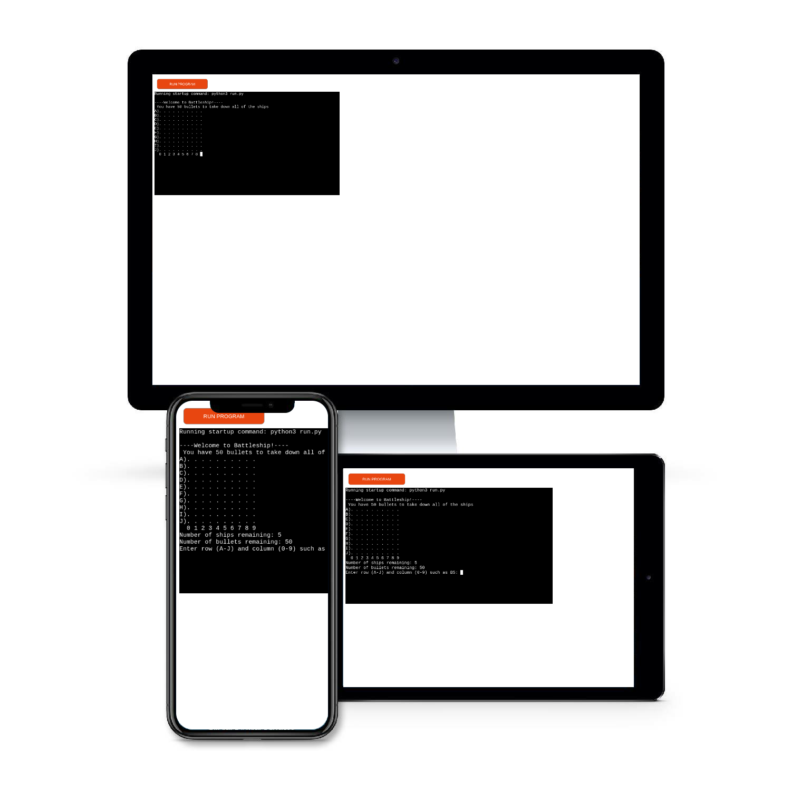

# Battleship
Battleship is a Python terminal game, which runs in the Code Institute mock terminal on Heroku.

Users have 50 bullets to try and sink 5 ships that are randomly generated on the 10 X 10 grid. Each ship can occupy between 3 and 5 spaces on the grid facing horizontally or vertically.

## [Here is a live version of my project](https://pp-3-python.herokuapp.com/)

---
## How to play
This Battleship game is based on the classic 1930s pen-and-paper game. You can read more about it [here](https://en.wikipedia.org/wiki/Battleship_(game)).

This version of the game is single-player. 

A 10 X 10 grid is generated along with 5 ships that can be between 3 and 5 spaces long randomly placed on the grid.

Guesses are made by inputting any letter (A-J) and number (0-9). 

The user's guesses are shown as `#` for a miss and `X` for a hit.

The user has 50 bullets to try and sink all of the 5 ships. 

If the user can sink all of the ships in 50 or fewer attempts they win.

If the user runs out of bullets they lose.

## Features
- __Existing Features__
  - Random Board Generation

  
  - Accepts user input

  
  - Keeps count of ships and bullets

  
  - Input validation and error check

  
  - Win message

  
- __Future Features__
  - Give the user the option to choose grid size and number of ships
  - Create another game mode where the user can play against the computer
  - Give the user the option to play again 
  - Make the ships have a buffer of 1 grid piece between them

## Testing
I have manually tested the project in the following ways:
  - Passed the code through PEP8 testing 
  - Input invalid inputs out of bounds inputs and the same input twice
  - Tested through local terminal and Heroku terminal

  ### Bugs
__Solved Bugs__
  - When writing the project I was having a hard time getting the ships to align with the grid. I fixed this problem by `adding 1` to `start_col` and `start_row`
  - I wasn't getting any ships to show on the grid but I had the value of `validate_grid_and_place_ship` empty and had to input `start_row, end_row, start_col, end_col`

__Remaining Bugs__
  - Sometimes the ships can be placed next to each other and it can make it confusing as to where the ships start and end

  ### Validator
  - [PEP8](http://pep8online.com/checkresult)

  ## Deployment
  This project was deployed using Code Institute's mock terminal on Heroku
__Steps for Deployment__
  - Fork or clone this repository
  - Create a new Heroku app
  - Set the buildbacks to `Python` and `NodeJS` in that order
  - Link Heroku and repository together
  - Click **Deploy**

  ## Credits
  - Code Institute for the deployment terminal 
  - StackOverFlow community 
  - [freeCodeCamp.org](https://www.youtube.com/c/Freecodecamp/playlists) on Youtube for great videos on python 